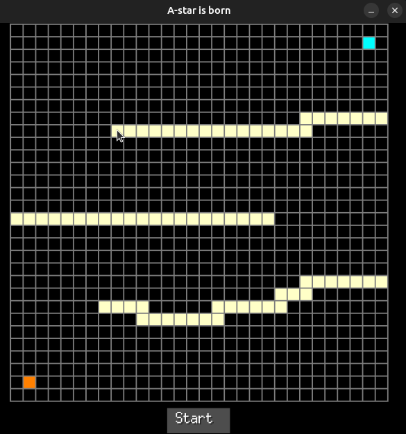
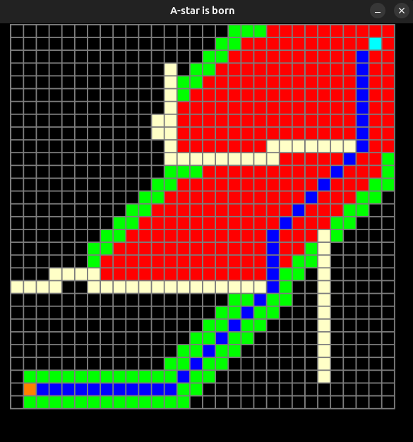
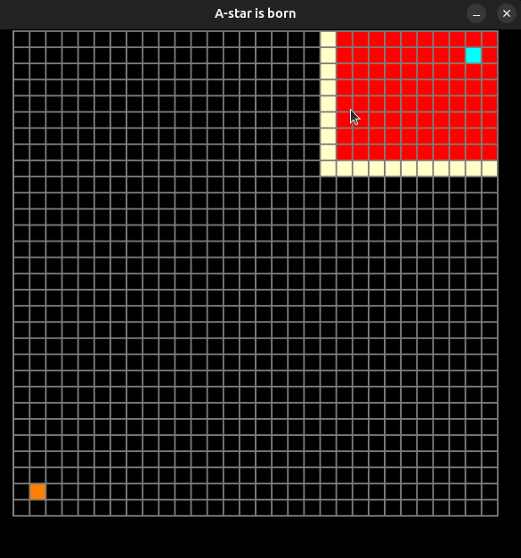

# A-star-is-born

This project aims to visualize how A* pathfinding algorithm works 

## About

The project has been developed with `golang` and `ebitengine` graphics package

## How to run it? 

There is make target `run` that will first build the project and then run the executable: 

```bash
    make run
```

## What am I looking at?

You will see a black board with two squares - `Start` and `End`. Simply draw some `obstacles` with the help of the mouse and its `left button` and hit `Start`:
 




After the game starts the algorithm will start looking for the shortest path from `start` (top right corner) to the `end` with the help of the `A*` pathfinding algorithm. When the path is found it will be painted in blue and the game will stop:





If no path exists from `start` to `end` the game will stop after exploring all possile grid cells.




